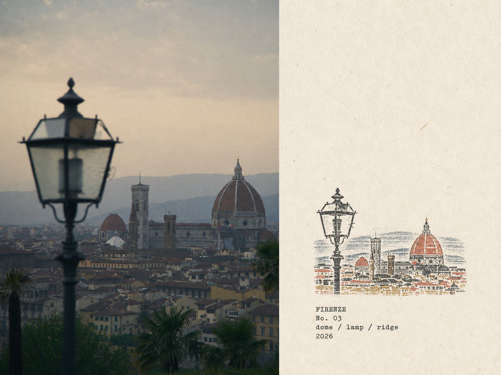
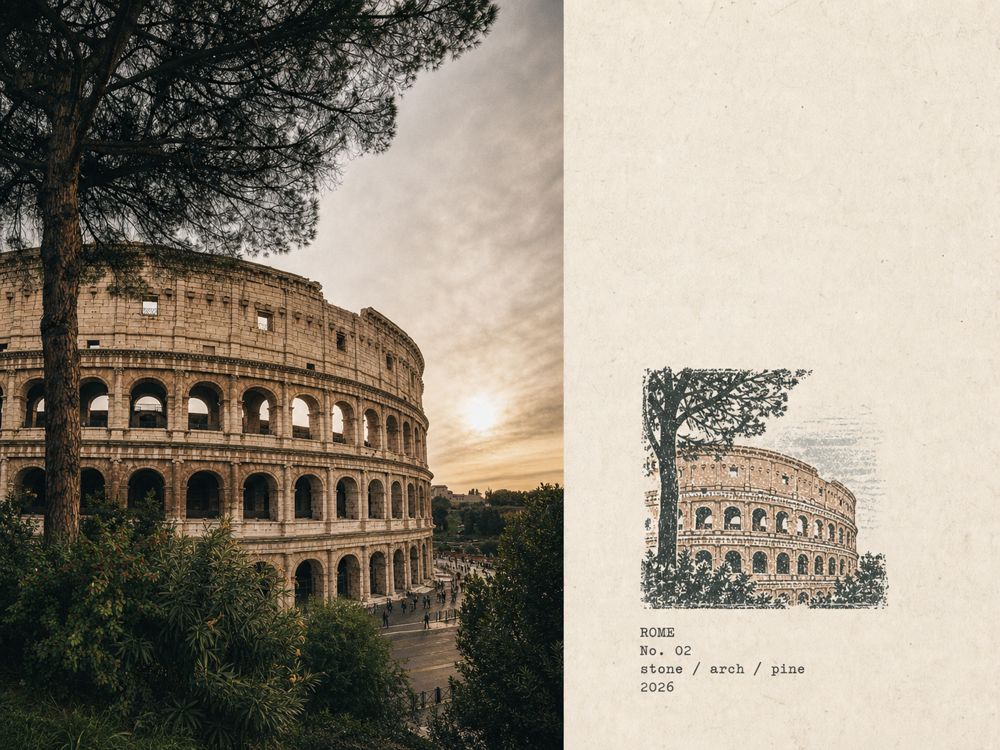
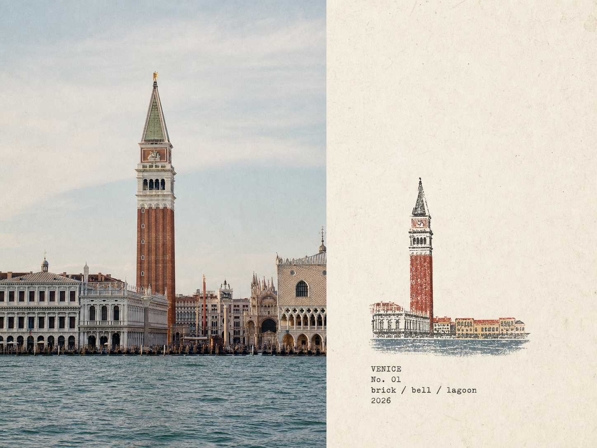
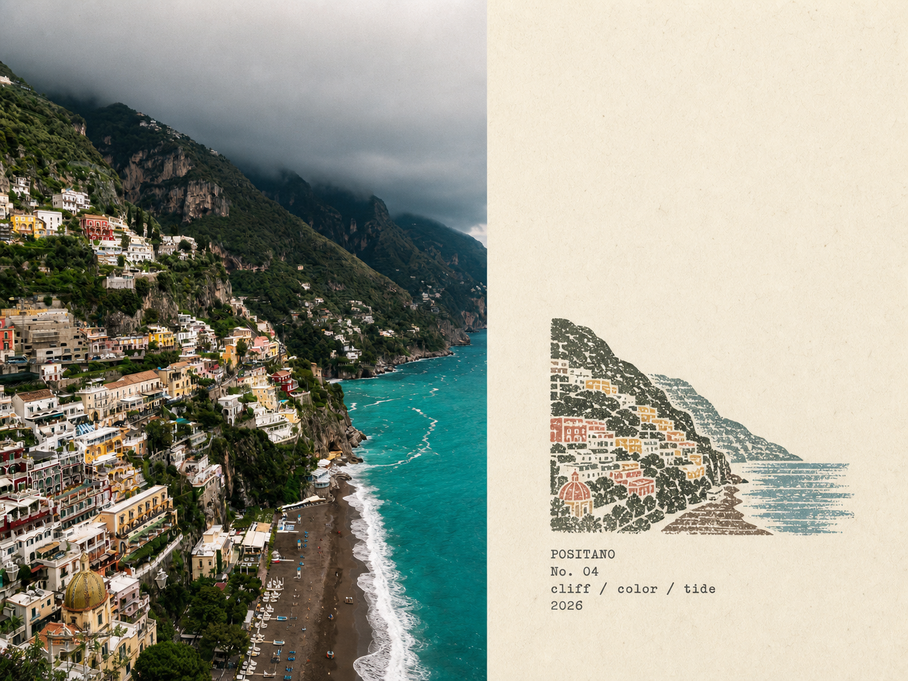
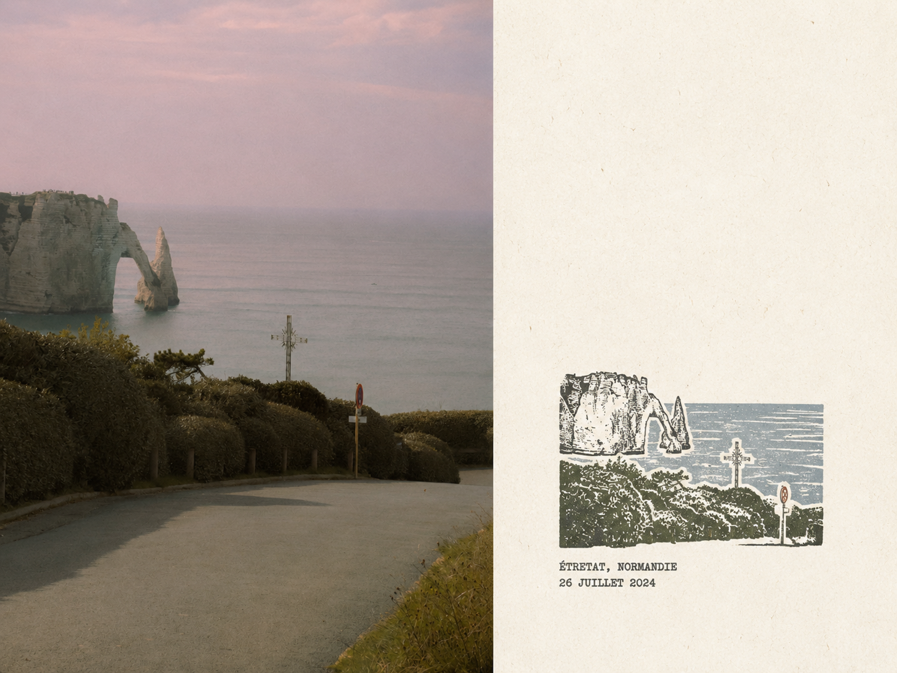
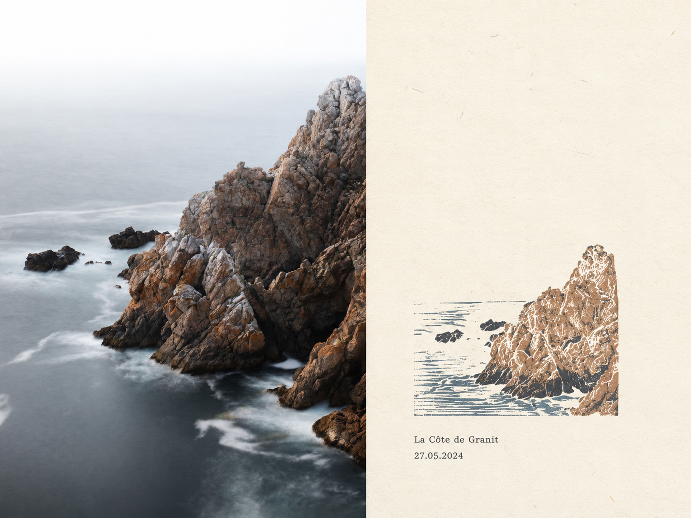
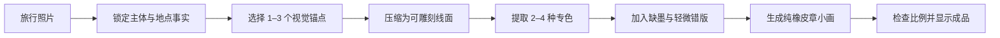

# My Travel Sketches

**我的旅途小画**

把真实旅途，刻成一幅留在旧纸上的手工印记。

一张照片 · 一张作品 · 左下小章 · 大片纸白 · 默认 3:4 竖版 · 支持指定比例

My Travel Sketches 是一个将旅行照片转化为独立橡皮章小画的 Skill。输入照片只用来识别场景、主体和色彩；最终成品只呈现旧纸上的多色手工章印。


## 作品展示

### FLORENCE｜穹顶与暮色

灯杆、穹顶和城市天际线被压缩成干涩的线面与少量专色。场景仍然可辨，但摄影细节被主动删减。



### ROME｜石拱与伞松

斗兽场的拱券、断墙与树冠保留原有重量，再通过缺墨、断边和轻微套色偏差获得手工制版质感。



### VENICE｜钟楼与潟湖

钟楼、天际线与水平水岸成为最少但足够辨认的视觉锚点，大面积纸白保留了安静的空间感。



### POSITANO｜悬崖与海

密集山城被重新组织为可雕刻的坡面、房屋与海岸，让复杂风景变成清晰的地形记忆。



### ÉTRETAT｜海蚀拱与十字架

海蚀拱、海岸灌木和十字架被压缩成少量套色线面，保留海边道路的现场辨识度。



### LA CÔTE DE GRANIT｜花岗岩海岸

礁石、海面和粗粝的岩壁构成单幅章印，示范大版居中构图中的主体提炼与纸白留存。



## 这套风格在做什么

| 照片中的信息 | 橡皮章如何保留 |
|---|---|
| 主体、数量、姿态与空间方向 | 保持事实准确，不镜像、不替换、不增删 |
| 地标轮廓、人物姿态、船车方向 | 压缩为适合手工雕刻的粗细线面 |
| 照片中的主要颜色 | 提取为 2–4 种低至中饱和专色油墨 |
| 复杂背景与摄影噪声 | 主动删除，让纸白承担空气与距离 |
| 旅行地点或场景情绪 | 提炼为极少量档案标题、关键词与年份 |

最终画面不是照片加滤镜，而是根据输入照片重新组织的一幅可雕刻、可盖印的图形。

默认小版保持与参考作品一致：章印小而克制地位于左下区域，归档文字紧接在章印下方并与其左边缘对齐；画面上方和右侧保留大片未印刷纸白。只有明确要求大版或居中格式时，才会改为单幅居中章印：宽度约占画布的 50%–60%，下方文字整体居中。

## 使用方式

### 默认 3:4 竖版

```text
使用 $my-travel-sketches，把我上传的每张旅行照片分别制作成橡皮章旅行小画。
```

### 指定其他比例

```text
使用 $my-travel-sketches，把这张照片制作成 16:9 横版橡皮章旅行小画。
```

用户没有指定比例时，默认采用 `3:4`（宽:高）竖版；明确指定比例时，以用户要求为准。

归档文字默认添加当前年份；明确指定年份时，使用用户提供的年份。

默认使用左下小版。只有明确提出“大版”或“居中格式”时，才使用单幅居中大版：章印宽度约占画布的 50%–60%，下方文字整体居中。大版不会复制或重复排列章印。

### 制作大版居中模式

```text
使用 $my-travel-sketches，把这张照片制作成大版居中格式的橡皮章旅行小画。
```

### 多张照片逐张处理

```text
使用 $my-travel-sketches 处理这四张照片。
每张照片单独生成一张纯橡皮章小画，不做拼贴，按输入顺序交付。
```

### 只返回 Prompt

```text
使用 $my-travel-sketches，只返回完整中文 Prompt，不生成图片。
```

### 先分析照片

```text
使用 $my-travel-sketches 分析这张照片。
告诉我最值得刻下的主体、建议的 2–4 种专色、构图、英文标题与潜在失败点。
```

## 从照片到印记



## 媒介配方

- `distressed rubber-stamp ink`
- `hand-carved linocut contours`
- `broken pigment coverage`
- `dry rough edges`
- `paper pinholes and missing flecks`
- `granular opaque spot colors`
- `subtle 1–2 mm color misregistration`
- `warm uncoated archival paper`
- `restrained negative space`
- `vintage typewriter or narrow serif caption`

### 强制避免

原照片区域、左右或上下对照、摄影拼贴、圆形姓名章、红色印泥、蜡封、护照章、邮票齿孔、纪念品 Logo、平滑矢量、数字渐变、水彩晕染、铅笔素描、塑料 3D、假地名、二维码、网址和产品样机。

## 质量门槛

一张合格作品必须同时满足：

- 最终画面没有原照片、照片裁片或对照分栏；
- 章印来自输入照片中的同一场景，主体一眼可辨；
- 未指定比例时使用 `3:4` 竖版，指定比例时服从用户要求；
- 默认小版章印位于左下且尺度克制，上方和右侧保留大片纸白；大版为宽度约占画布 50%–60% 的单幅居中章印；
- 文字位于章印下方；小版左对齐章印左边缘，大版整体居中；
- 颜色取自照片，且限制在 2–4 色；
- 油墨具有真实缺口、颗粒与轻微套印偏差；
- 文字少而准确，默认使用当前年份，用户指定年份时服从用户要求；
- 无法确认的地点不编造；
- 最终图片已经保存，并作为可见图片显示在聊天中。

完整检查表见 [references/quality-gate.md](references/quality-gate.md)。

## 视觉素材分工

- `assets/showcase/`：README 使用的完整转换对照图，展示输入照片与章印结果之间的关系。
- `assets/examples/`：裁去原照片后的纯章印图，供 Skill 校准印刷质感、留白与文字密度。

对照图不会被 Skill 当作输出格式参考。只有在需要校准版式密度与印刷质感时，Skill 才会查看 `assets/examples/`；案例是媒介参考，不是内容模板。

## 目录结构

```text
my-travel-sketches/
├── SKILL.md
├── README.md
├── LICENSE
├── agents/
│   └── openai.yaml
├── assets/
│   ├── showcase/                README 对照图
│   └── examples/                Skill 纯章印参考图
├── docs/
│   └── CREDITS.md               摄影素材来源与许可
└── references/
    ├── prompt.zh-CN.md
    ├── quality-gate.md
    └── style-system.md
```

详细工作流、视觉约束和请求模式请参阅 [SKILL.md](SKILL.md)。公开案例的摄影者、原始页面与许可证见 [docs/CREDITS.md](docs/CREDITS.md)。

## 来源与致谢

My Travel Sketches 基于 Mr-funny 创作的开源项目 [hbg-rubber-stamp-field-note](https://github.com/Mr-funny/hbg-rubber-stamp-field-note) 调整而来。原项目建立了旅行照片与手工多色橡皮章之间的视觉语言、场景提炼方法和印刷质感规范；本项目在此基础上改为只输出橡皮章小画，并加入默认 `3:4` 竖版与自定义比例支持。感谢 Mr-funny 分享原始创意、Skill 结构和示例素材。

## 许可证

本项目沿用原项目的 [MIT License](LICENSE)，可在保留版权声明与许可声明的前提下使用、复制、修改和分发。公开案例中的原始摄影作品不属于 MIT 授权范围，仍遵循各自的 [Pexels License 与素材署名](docs/CREDITS.md)。
